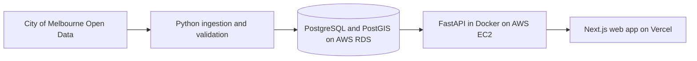

<<<<<<< HEAD
# CityFlow

> Sensory-aware wayfinding for calmer and more predictable journeys through Melbourne CBD.

CityFlow is a web-based accessibility project developed by **FIT5120 Team 18**. It uses aggregated City of Melbourne pedestrian data, spatial information and time-based analysis to help sensory-sensitive adults understand crowd conditions and make more informed journey decisions.

| Project information | Details |
| --- | --- |
| Course | FIT5120 Industry Experience |
| Team | Team 18, six members |
| Current phase | Onboarding build, active development |
| Product | Web-based application |
| UN Sustainable Development Goal | SDG 11: Sustainable Cities and Communities |
| Repository access | Private during development |
| Live demo | Coming soon |

## Project Overview

Many navigation tools primarily optimise travel time and distance. For neurodivergent adults and other people with sensory sensitivities, the fastest route may still pass through crowded and unpredictable locations that increase anxiety or sensory overload.

CityFlow is designed to make Melbourne CBD journeys calmer and more predictable. It combines historical pedestrian patterns, recent sensor readings, location data and short-term forecasting to help users:

- understand when and where crowd exposure is likely to be high;
- compare routes using sensory and crowd information;
- identify quieter travel windows;
- receive advance warning of areas that may soon become crowded; and
- find nearby lower-sensory places when a break is needed.

The application does not require user accounts and does not track individuals. It operates only on aggregated public data.

## Problem Statement

Sensory-sensitive adults who rely on public transport and walking currently have limited access to real-time, sensory-aware wayfinding support in Melbourne CBD. Dense pedestrian corridors, unexpected crowd changes and limited advance information can make independent travel stressful and difficult to plan.

**How might we make Melbourne CBD easier to navigate for sensory-sensitive adults?**

## Intended Users

The primary users are neurodivergent adults and other adults with sensory sensitivities who travel through Melbourne CBD for work, study, appointments or daily activities.

Their core goals are to:

- preview likely crowd conditions before beginning a journey;
- choose a route with lower expected sensory exposure;
- avoid unexpected high-density pedestrian corridors;
- adjust departure time when a calmer period is available; and
- recover safely when a journey becomes overwhelming.

## Planned Features

| Feature | Description | Status |
| --- | --- | --- |
| Sensory-aware route planning | Compares route options using pedestrian exposure and spatial information, with a focus on calmer travel rather than travel time alone. | Planned |
| Current crowd conditions | Compares recent pedestrian counts with the normal level for each sensor location. | Planned |
| Short-term crowd forecasting | Estimates which locations may become busier within the next hour. | Planned |
| Calm Window | Suggests a quieter departure window when crowd exposure is expected to be lower. | Planned |
| Sensory Journey Preview | Shows the expected sensory conditions across different stages of a journey before the user leaves. | Planned |
| Recovery Mode | Helps the user locate a nearby lower-sensory place or choose an alternative route when the current journey becomes overwhelming. | Planned |
| Crowd and sensory indicators | Presents route and location conditions in a simple, accessible form such as low, medium and high. | Planned |

Feature status will be updated as each user story is implemented, tested and accepted.

## Project Status and Roadmap

- [x] Define the problem domain and primary user needs
- [x] Develop the initial persona, empathy map and ideation artefacts
- [x] Select and assess the initial open-data sources
- [x] Complete initial hindsight, current insight and foresight analysis
- [x] Agree on the initial technology stack and deployment approach
- [ ] Initialise the monorepo structure
- [ ] Build the Next.js frontend foundation
- [ ] Build the FastAPI backend and health endpoint
- [ ] Configure PostgreSQL and PostGIS for local development
- [ ] Implement historical and recurring data-ingestion pipelines
- [ ] Implement the first sensory-aware route workflow
- [ ] Deploy the first integrated build
- [ ] Complete usability, accessibility and acceptance testing

## Target System Architecture



The target architecture uses:

- **AWS CloudFormation** to define AWS networking, security, EC2 and RDS resources;
- **GitHub Actions** for automated checks and application deployment;
- an **EC2 cron job** as the primary recurring data-update mechanism;
- a **scheduled GitHub Actions workflow** as a backup data-update option; and
- a Python forecasting or AI component served inside the FastAPI container initially, with AWS SageMaker retained as a future option if required.

The application deployment pipeline, historical bulk loader and recurring data-update pipeline remain separate. A code deployment must not automatically reload the historical dataset.

## Technology Stack

| Layer | Technology |
| --- | --- |
| Frontend | Next.js, TypeScript and Tailwind CSS |
| Frontend hosting | Vercel as the primary host; AWS Amplify as an optional alternative |
| Backend | Python and FastAPI |
| Local development on macOS | Lima and Docker |
| Local development on Windows | WSL2 and Docker Desktop |
| Backend hosting | AWS EC2 with the backend running in a Docker container |
| Database | AWS RDS with PostgreSQL and PostGIS |
| Infrastructure as Code | AWS CloudFormation |
| AI or ML serving | FastAPI container initially; AWS SageMaker if future model requirements justify it |
| CI/CD | GitHub Actions |
| Historical data ingestion | Reusable Python bulk-loader script, run separately from application deployment |
| Recurring data ingestion | EC2 cron job as the primary runner; scheduled GitHub Actions workflow as backup |
| Authentication | Not implemented by design |

## Open Data Sources

CityFlow uses public, aggregated datasets from the City of Melbourne Open Data Portal.

| Dataset | Intended use |
| --- | --- |
| [Pedestrian Counting System - Past Hour (counts per minute)](https://data.melbourne.vic.gov.au/explore/dataset/pedestrian-counting-system-past-hour-counts-per-minute/) | Recent pedestrian conditions and directional counts |
| [Pedestrian Counting System (counts per hour)](https://data.melbourne.vic.gov.au/explore/dataset/pedestrian-counting-system-monthly-counts-per-hour/) | Historical baselines, recurring crowd patterns and forecasting |
| [Pedestrian Counting System - Sensor Locations](https://data.melbourne.vic.gov.au/explore/dataset/pedestrian-counting-system-sensor-locations/) | Sensor coordinates, status and directional metadata |
| [Pedestrian Network](https://data.melbourne.vic.gov.au/explore/dataset/pedestrian-network/) | Walkable network representation and route analysis |
| [Landmarks and places of interest](https://data.melbourne.vic.gov.au/explore/dataset/landmarks-and-places-of-interest-including-schools-theatres-health-services-sports/) | Candidate parks, libraries, public facilities and other potential recovery locations |

Data refresh frequency varies by source. The past-hour dataset is intended for recent conditions, while the hourly historical dataset is refreshed on a longer cycle. Ingestion schedules will be configured according to the official update frequency of each source.

Large raw datasets are not stored in this repository. Instead, the repository will contain:

- source links and data documentation;
- small, non-sensitive samples where required for testing;
- reusable extraction, cleaning and validation code;
- database schemas and migration files; and
- instructions for rebuilding the development dataset.

## Data Processing Approach

The planned data flow is:

1. Extract data from the approved public API or downloadable source.
2. Validate source fields, timestamps, sensor identifiers and coordinates.
3. Remove or flag duplicate, incomplete and invalid records according to documented rules.
4. Transform raw counts into analysis-ready values and crowd indicators.
5. Load validated records into PostgreSQL and PostGIS.
6. Generate historical patterns, recent-condition comparisons and forecast inputs.
7. Serve application-ready results through FastAPI endpoints.
8. Record pipeline outcomes and archive data according to the agreed retention plan.

Historical data is loaded through a manually triggered bulk-loader script. Recurring sources are fetched on a schedule appropriate to the dataset. Both paths reuse the same cleaning and validation functions so that records are processed consistently.

## Planned Repository Structure

```text
cityflow-5120-team18/
├── .github/
│   ├── ISSUE_TEMPLATE/
│   ├── workflows/
│   ├── CODEOWNERS
│   └── PULL_REQUEST_TEMPLATE.md
├── frontend/                   # Next.js web application
├── backend/                    # FastAPI application, migrations and tests
├── data/
│   ├── sample/                 # Small test-safe sample data only
│   ├── schemas/                # Source and validation schemas
│   └── README.md               # Data sources and field documentation
├── scripts/
│   └── ingestion/              # Historical and recurring data loaders
├── infrastructure/
│   └── cloudformation/         # AWS infrastructure templates
├── docs/
│   ├── decisions/              # Architecture and technology decisions
│   ├── database/               # ERD and database documentation
│   ├── architecture.md
│   └── setup.md
├── .env.example                # Variable names only, never real credentials
├── .gitignore
├── compose.yaml
├── CONTRIBUTING.md
└── README.md
```

Directories will be added through implementation issues as the corresponding components are initialised. Empty folders are not created only for appearance.

## Getting Started

The application scaffold is currently being initialised. Exact setup commands will be added after the frontend, backend and local database configuration are merged and verified.

The planned local-development requirements are:

- Git;
- Node.js and a project-selected package manager for the frontend;
- Python and a project-selected dependency-management workflow for the backend;
- Docker and Docker Compose;
- Lima for macOS contributors; or
- WSL2 with Docker Desktop for Windows contributors.

Once the initial scaffold is available, a contributor will be able to:

1. clone the repository;
2. copy `.env.example` to a local `.env` file;
3. start PostgreSQL and PostGIS through Docker Compose;
4. start the FastAPI backend;
5. start the Next.js frontend; and
6. open the documented local-development URL.

Only commands that have been tested by the team will be added to this section. Detailed operating-system instructions will be maintained in `docs/setup.md`.

## API Documentation

FastAPI will provide interactive OpenAPI documentation when the backend is running:

- Swagger UI: `/docs`
- ReDoc: `/redoc`

The deployed backend URL will be added after the first stable release.

## Contribution Workflow

All implementation work should be connected to a GitHub Issue.

1. Create or select an Issue with clear acceptance criteria.
2. Assign one primary owner.
3. Create a short-lived branch from the latest `main` branch.
4. Make focused commits with descriptive messages.
5. Open a Draft Pull Request early when collaboration is useful.
6. Link the Pull Request to the Issue using `Closes #<issue-number>`.
7. Complete testing, CI checks and at least one peer review.
8. Resolve review conversations before merging.
9. Squash and merge into `main`, then delete the merged branch.

Recommended branch formats:

```text
feature/12-route-map
fix/27-api-timeout
data/14-clean-pedestrian-counts
infra/22-create-rds-template
docs/8-update-tech-stack
chore/1-repository-scaffold
```

Recommended commit formats:

```text
feat(frontend): add route comparison layout
feat(api): add pedestrian exposure endpoint
fix(data): handle missing sensor coordinates
docs: update local setup instructions
ci: add frontend build check
```

See [CONTRIBUTING.md](CONTRIBUTING.md) for the full team workflow.

## Privacy, Security and Responsible Use

CityFlow follows a privacy-minimising design:

- no login, user account or authentication is required;
- no personal identifiers, precise user histories or behavioural profiles are stored;
- the project uses aggregated pedestrian counts, not images or individual movement records;
- public pedestrian data will not be merged with personal datasets;
- credentials and API keys must never be committed to the repository;
- `.env` files, database dumps and large raw datasets must remain outside version control; and
- AWS, database and external API access must use restricted credentials and environment variables.

Predictions and route indicators are decision-support information, not guarantees. The interface must communicate uncertainty, data freshness and coverage limitations clearly.

## Current Limitations

- Sensor coverage is concentrated in locations monitored by the City of Melbourne and does not represent every street equally.
- Pedestrian volume is one component of sensory load and cannot represent every user's experience.
- Sensor downtime, delayed updates and missing records may affect current-condition estimates.
- Forecasts are probabilistic and may not reflect unexpected events, construction or disruptions unless relevant data is available.
- The initial project scope is Melbourne CBD and should not be generalised to unsupported areas.
- CityFlow is not an emergency, medical or personal-safety service.

## SDG Alignment

CityFlow supports **United Nations Sustainable Development Goal 11: Sustainable Cities and Communities**, particularly the goals of improving accessible transport and inclusive public spaces. The project explores how public urban data can support more independent and comfortable mobility for people with sensory sensitivities.

## Team

Team 18 includes six members with complementary backgrounds:

| Discipline | Team representation | Primary contribution areas |
| --- | ---: | --- |
| Data Science | 3 members | Data ingestion, cleaning, spatial and time-series analysis, forecasting and evaluation |
| Artificial Intelligence | 1 member | Model design, integration and evaluation |
| Information Technology | 1 member | Application architecture, frontend/backend integration and cloud deployment |
| Business Information Systems | 1 member | Requirements, user stories, governance, stakeholder alignment and documentation |

Individual ownership is recorded in GitHub Issues and Pull Requests rather than maintained as a static list in this README.

## Documentation

| Document | Location | Status |
| --- | --- | --- |
| Contribution guide | [CONTRIBUTING.md](CONTRIBUTING.md) | Available |
| Local setup guide | `docs/setup.md` | Planned |
| System architecture | `docs/architecture.md` | Planned |
| Technology decision record | `docs/decisions/0001-tech-stack.md` | Planned |
| Database ERD | `docs/database/erd.png` | Planned |
| API documentation | FastAPI `/docs` | Planned |

## Data Attribution and Licence

CityFlow uses data made available by the City of Melbourne Open Data Portal. Source datasets must be attributed according to their published terms, including the [Creative Commons Attribution 4.0 International licence](https://creativecommons.org/licenses/by/4.0/) where applicable.

No open-source licence has currently been assigned to the CityFlow source code. The data licences and the source-code licence are separate and must not be treated as interchangeable.

## Acknowledgements

- City of Melbourne Open Data Portal for pedestrian, sensor, network and landmark data.
- Monash University FIT5120 teaching staff and project mentors for project guidance and feedback.

=======
This is a [Next.js](https://nextjs.org) project bootstrapped with [`create-next-app`](https://nextjs.org/docs/app/api-reference/cli/create-next-app).

## Getting Started

First, run the development server:

```bash
npm run dev
# or
yarn dev
# or
pnpm dev
# or
bun dev
```

Open [http://localhost:3000](http://localhost:3000) with your browser to see the result.

You can start editing the page by modifying `app/page.tsx`. The page auto-updates as you edit the file.

This project uses [`next/font`](https://nextjs.org/docs/app/building-your-application/optimizing/fonts) to automatically optimize and load [Geist](https://vercel.com/font), a new font family for Vercel.

## Learn More

To learn more about Next.js, take a look at the following resources:

- [Next.js Documentation](https://nextjs.org/docs) - learn about Next.js features and API.
- [Learn Next.js](https://nextjs.org/learn) - an interactive Next.js tutorial.

You can check out [the Next.js GitHub repository](https://github.com/vercel/next.js) - your feedback and contributions are welcome!

## Deploy on Vercel

The easiest way to deploy your Next.js app is to use the [Vercel Platform](https://vercel.com/new?utm_medium=default-template&filter=next.js&utm_source=create-next-app&utm_campaign=create-next-app-readme) from the creators of Next.js.

Check out our [Next.js deployment documentation](https://nextjs.org/docs/app/building-your-application/deploying) for more details.
>>>>>>> 20bb54d (Added nextJS Frontend with maps Features)
